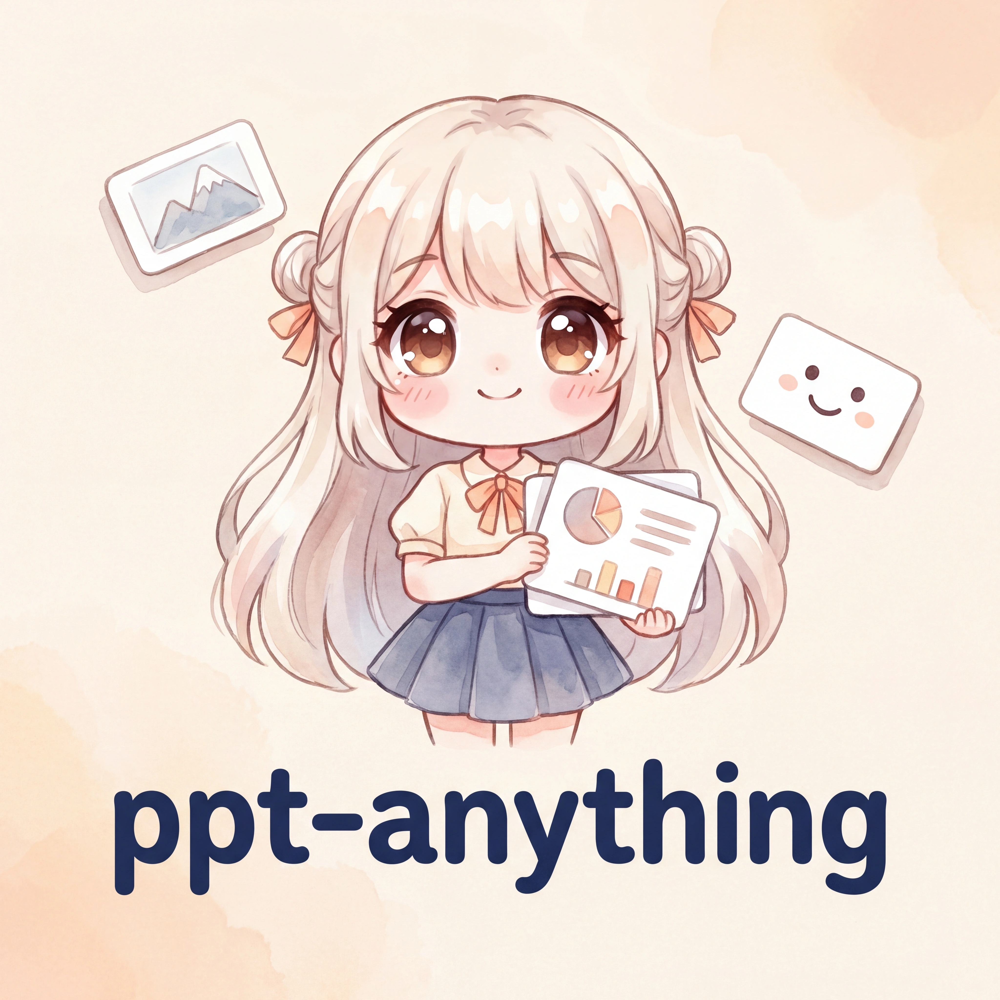

<div align="center">



# ppt-anything

### 任何人都能用的 AI 故事 PPT 生成器

<p>给一个主题，吐回一套连贯、有人物、有审美、能直接讲的插画 PPT。</p>

<p><b>English intro:</b> ppt-anything is an AI story-deck generator that turns one topic into a coherent illustrated presentation with reusable characters, style packs, provider profiles, and an outline approval gate.</p>

<p>
  <a href="README.md"><b>中文</b></a>
  &nbsp;|&nbsp;
  <a href="README_EN.md"><b>English</b></a>
</p>

<p>
  <a href="https://crosery.github.io/ppt-anything/"><b>Live Demo</b></a>
  &nbsp;·&nbsp;
  <a href="#快速开始"><b>快速开始</b></a>
  &nbsp;·&nbsp;
  <a href="#库系统"><b>库系统</b></a>
  &nbsp;·&nbsp;
  <a href="#解决的痛点"><b>解决的痛点</b></a>
  &nbsp;·&nbsp;
  <a href="AGENT.md"><b>AGENT 总入口</b></a>
</p>

<sub>Cross-AI-CLI skill · Claude Code / Gemini CLI / Codex CLI / Cursor · Bring your own image-generation key</sub>

</div>

---

<div align="center">

## 架构一览


</div>

---

## 一句话

`ppt-anything` 是一个跨 AI CLI 的 skill，把"做一套讲故事的 PPT"这件事拆成了：
**人物库 + 风格模板库 + 生图 Provider 库**，三个库都可以挑、可以扩，AI 也能自动去网上找资料更新。
默认配置开箱即用，进阶用户可以替换任意一层。

不是模板填空。每张 slide 都按"内容是主角，人物服务情绪，装饰服务氛围"的层级被设计过。

---

## 解决的痛点

| 你以前的痛点 | ppt-anything 怎么解 |
|---|---|
| 用 LLM 一次生成一组图，人物每张都漂 | 强制 reference image + outline gate，5 张 deck 主角能稳得住 |
| 风格随便挑一个，不知道怎么写 prompt | 风格模板库，默认一套萌系日漫水彩，可换可加 |
| 不知道用哪个生图 API | Provider 库统一抽象，AI 自动选最合适的 |
| 中文字一模糊就废 | 默认走 LXGW 文楷 + 高分辨率 + 中文词级精确 prompt |
| 一键生成最后是文字墙 PPT | outline 必须经你过目，没拍板不烧钱 |

---

## 核心特性

- **三库可扩展** — `characters` / `styles` / `providers`，全部住在 `~/.ppt-anything/`
- **Outline gate** — 任何生图前必须先把故事大纲拿给你过，杜绝烧钱试错
- **Reference image 纪律** — 每张 slide 都用原始角色图 + 上一张 slide 双重 anchor，主角不漂
- **Layout × Beat 方法论** — A-H 布局 + scene-ify 自定义场景，按情绪选版式不靠模板
- **Content-first** — 视觉读取顺序强制 内容 &gt; 人物 &gt; 装饰，杜绝喧宾夺主
- **轻量交付** — 默认 WebP 外链 HTML（~3KB 壳 + 几 MB 图），秒开
- **零 emoji** — 所有产出物（PPT/插画/文档/UI label/commit message）禁用 emoji

---

## 快速开始

### 1. 克隆 + 安装

```bash
git clone https://g.ktvsky.com/chengyaoyu/ppt-anything.git ~/work_file/ppt-anything
cd ~/work_file/ppt-anything
bash scripts/install.sh
```

`install.sh` 做的事：
- `cp -R skill/` → `~/.claude/skills/ppt-anything/`（已存在则备份到 `.bak.<时间戳>/`）
- 把 `defaults/` 拷到 `~/.ppt-anything/`（首次安装，已存在则跳过）
- 检查 `cwebp` + Python 3.11+ tomllib

### 2. 配一个生图 provider

`install.sh` 会把 `google.toml.example` 平铺成 `google.toml` —— 默认指向 **Google 官方 Gemini Image API**，`base_url` / `docs_url` / `auth_style` 已经预填官方值，你只需要填 `api_key`：

```bash
# 1) 去 https://aistudio.google.com/app/apikey 申请一个 Gemini API key
# 2) 自己用编辑器粘进去（强烈推荐，AI agent 永远不经手 key）
vim ~/.ppt-anything/providers/google.toml
```

**想接第三方桥接**（任何 Gemini-shape 或 OpenAI-image-compatible 网关）：
- **自己加（推荐，安全）**：`cp google.toml my-bridge.toml`，把 `base_url` 改成桥接网关地址，`auth_style` 改成 `"bearer"`，填 `api_key`
- **让 AI 加（有风险）**：在 AI CLI 里说"帮我加一个第三方桥接"，准备好 base_url + api_key + 文档链接 + auth_style。**注意**：把 api_key 给 AI agent 意味着 key 会进 agent 的对话上下文（可能被缓存 / 记忆系统持久化 / 多轮复述）。AI 会先警告再二次确认。

**铁律**：
- AI agent 不读 toml 文件本体（不会把 key 读进上下文）
- AI agent 帮你建新 toml 后必须跑连通性自检，验通才算注册成功
- AI 永远不替你生成 / 保管 api_key

### 3. 在你的 AI CLI 里调用

**Claude Code**：

```
/ppt-anything 做一套 PPT 讲 strong-rl 怎么从 0 到峡谷段位
```

**其他 CLI**：见 [`AGENT.md`](AGENT.md)，里面写了 Claude / Gemini CLI / Codex CLI / Cursor 怎么各自接入这个项目。

---

## 库系统

所有可扩展的资产都住在 **`~/.ppt-anything/`**（不在项目仓库里），方便跨 CLI、跨项目复用：

```
~/.ppt-anything/
├── characters/    人物库  (默认: 橙橙 chengcheng + 蓝蓝 lanlan, 「搭子」AI OC 双核 mascot)
├── styles/        风格模板库  (默认: anime-chibi-default 萌系日漫水彩)
├── providers/     生图 API 库  (默认只装 google.toml 指向官方 Gemini API; 其他渠道靠扩展)
└── demo/          每次生成的成品归档 (按日期 + 主题命名)
```

**默认值**：启动 skill 时会告诉你"这次默认用 [橙橙 + 蓝蓝 搭子双核] 角色 + [萌系日漫] 风格 + [google] provider，要换吗？"。
**自动扩展**：你说"用某某动漫角色"或"用某某风格"，AI 没有的话会去网上搜，下载、写 profile、塞进库，下次直接用。

详见 [`docs/library-management.md`](docs/library-management.md)。

---

## 项目结构

```
ppt-anything/
├── README.md                    给人看
├── AGENT.md                     给 AI CLI 看的总入口
├── CLAUDE.md / GEMINI.md / ...  桩文件，指向 AGENT.md
├── skill/                       skill 本体 (SKILL.md + tools/)
│                                被 install.sh cp -R 到 ~/.claude/skills/ppt-anything/
├── defaults/                    首次安装时拷到 ~/.ppt-anything/ 的默认库
│   ├── characters/chengcheng/   橙橙 (搭子双核之「冲」)
│   ├── characters/lanlan/       蓝蓝 (搭子双核之「稳」)
│   ├── styles/anime-chibi-default/
│   └── providers/google.toml.example       出厂只装它一个, 默认指向 Google 官方 Gemini API
│                                           第三方桥接 (Gemini-shape 或 OpenAI-image-compatible) 由用户/AI 临时建
├── docs/                        进阶文档
├── scripts/install.sh
└── assets/                      项目自身的 logo / 架构图
```

---

## 设计原则

1. **内容是主角** — 人物、姿势、场景、装饰都为内容服务，让位给标题和正文
2. **Outline 先于生图** — 大纲不过审，一张图都不画
3. **Reference image 是铁律** — 文字描述模型会自由发挥，必须给图
4. **顺序生成** — 串行，不并行，避免 API 风控
5. **库可扩展** — 用户不该被默认值绑死

---

## 致谢与出处

源自 [`~/.claude/skills/ppt-anything`](https://g.ktvsky.com/chengyaoyu/ppt-anything)（@Crosery 私人 skill），
解耦 + 抽象 + 库化后开放给所有人。

<div align="center">
<sub>Made with watercolor anime by 橙橙 + 蓝蓝 搭子双核</sub>
</div>
